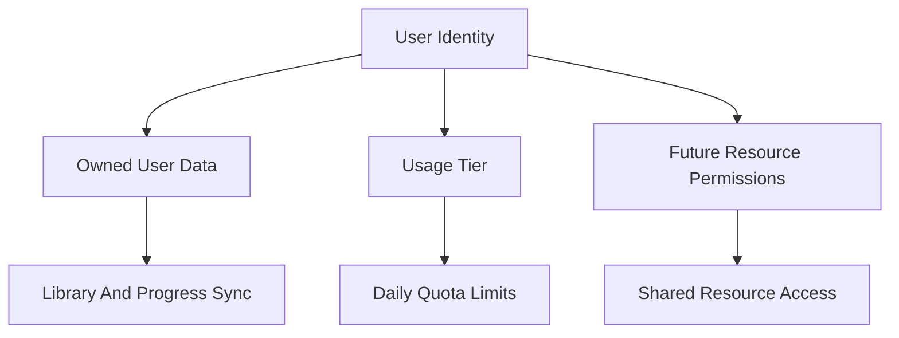

# User System And Permissions Plan

## Purpose

Define how Nemu should evolve user-system and permission architecture after usage limits, without mixing quota tiers with access control.

This plan follows `usage-limits.md` because the current product need is quota, not permissions. Permissions should be designed around real shared resources once those features exist.

## Current Codebase Facts

- Authentication is handled by `@convex-dev/better-auth` in `convex/auth.ts`.
- `convex/auth.ts` exposes `getCurrentUser`, `getHttpSession`, and `getOAuthProvider`.
- User-scoped app data uses string `userId` values, currently based on `identity.subject` from Convex auth.
- Existing synced tables in `convex/schema.ts` are single-user scoped: `settings`, `library_items`, `library_source_links`, `chapter_progress`, and `manga_progress`.
- The in-flight collections feature (PR #6) adds two more single-user scoped tables — `collections` and `collection_items` — with a client-generated `collectionId` (UUID) and a `(userId, collectionId, libraryItemId)` join. Cascade deletes are wired into `library.remove` / `library.clearAll`.
- Collections give the app its first user-defined grouping primitive over `library_items`, but they are still owned by a single `userId`. There is no `ownerUserId` / membership separation yet.
- There is no current permissions, roles, organizations, admin table, or shared-library schema.
- The local/cloud sync model assumes ownership by one effective profile/user at a time.
- Usage-limit work may add `usage_plans`, but that table is only a quota tier override.

## Product Rules

- `supporter` is not a permission role.
- App feature access should not be represented as booleans like `canUseTts`.
- Permissions should be introduced only when there is a shared resource to protect.
- The first permission model should likely be resource-based, not global RBAC.
- Existing single-user library behavior should remain simple until sharing exists.

## Concept Boundaries




Keep these separate:

- Identity answers "who is this user?"
- Ownership answers "which records belong to this user?"
- Quota tier answers "how much hosted AI can this user consume?"
- Permission answers "can this user access this shared resource?"

## Anti-Goal

Do not build this as the foundation:

```ts
type UserPermissionFlags = {
  userId: string;
  canUseChat: boolean;
  canUseTts: boolean;
  canEditMetadata: boolean;
  canManageSources: boolean;
};
```

That design duplicates usage-limit decisions, creates unclear self-host behavior, and turns every feature into an access-control decision.

## Future Permission Shape

When permissions become necessary, prefer a resource-based table:

```ts
{
  subjectUserId: string;
  resourceType: "library" | "source" | "admin";
  resourceId: string;
  role: "owner" | "editor" | "viewer";
  grantedByUserId: string;
  createdAt: number;
  updatedAt: number;
}
```

Suggested indexes:

- `by_subject`: `["subjectUserId"]`
- `by_resource`: `["resourceType", "resourceId"]`
- `by_subject_resource`: `["subjectUserId", "resourceType", "resourceId"]`

This fits a Jellyfin-style model where access is attached to libraries, folders, or other concrete resources.

## Likely Triggers

Do not implement permissions until one of these exists:

- Shared libraries
- **Shared collections** — collections are a smaller, lower-risk sharing unit than a whole library and are the most likely first shared-resource trigger. See "Collections As First Shared Resource" below.
- Family accounts
- Per-library viewer/editor access
- Admin dashboard
- Source/package moderation
- Organization/team spaces

## Collections As First Shared Resource

Collections (PR #6) are intentionally introduced as single-user data, but they are the cleanest candidate for the *first* shared-resource feature, ahead of full library sharing:

- **Smaller blast radius.** A collection is a curated subset; sharing one does not expose the operator's whole library.
- **Already has a stable id.** `collectionId` is a client-generated UUID, distinct from any owner's `userId`. That is the shape `permissions.md` recommends for shared resources — a resource id that is not the owner id.
- **Per-user progress already isolated.** `chapter_progress` and `manga_progress` are keyed by `userId` independently of any grouping, so a viewer's read state stays their own even when the collection contents are shared.
- **Membership table already exists.** `collection_items` is a join table; granting access does not require restructuring `library_items`.

If/when sharing ships, the migration shape is roughly:

1. Add `ownerUserId` to `collections` (initially `= userId` for all existing rows).
2. Stop using `userId` on `collection_items` as an access check; use `resource_permissions` keyed by `("collection", collectionId)` instead.
3. Resolve the books in a shared collection through the *owner's* `library_items` for metadata, while keeping the *viewer's* `chapter_progress` and `manga_progress` for read state.
4. UI: surface "shared with me" collections separately from owned ones in the library title menu.

This is **not** a green-light to ship sharing — the first three phases below still apply. It is a note that when the trigger lands, collections, not whole libraries, are the expected starting point.

## Phases

### Phase 1: Keep Usage Tier Separate

Dependency:

- `docs/plans/usage-limits.md` Phase 2 introduces `usage_plans`.

Deliverables:

- Document in code comments that `usage_plans` is only quota tier state.
- Avoid using `usage_plans.tier` for UI permissions or feature flags.
- Keep quota checks in the usage layer.

This phase happens during usage-limit implementation.

### Phase 2: User System Inventory

Deliverables:

- Audit all uses of `userId`, `identity.subject`, `session.user.id`, and local profile ids.
- Document which id is canonical for Convex ownership.
- Document how local-only profiles relate to Better Auth users.
- Identify any places where UI assumes "signed in" means "can access all cloud features."

This should happen before shared-library or admin features.

### Phase 3: Shared Resource Design

Only start when there is a product feature such as shared libraries or shared collections.

Deliverables:

- Define the first shared resource type. **Default expectation: `collection`** (see "Collections As First Shared Resource" above), with `library` deferred.
- Decide whether the resource id stays as the existing `collectionId` (already a UUID separate from `userId`) or moves behind a new container id.
- Decide whether current `library_items.userId` remains owner id or moves behind a separate library/container id.
- Define owner/editor/viewer semantics.
- Define how progress behaves for shared resources: per-user progress (`chapter_progress`, `manga_progress`) should stay per-user even when collection or library metadata is shared.
- Define migration path from current single-user rows. For collections, this likely means adding `ownerUserId` and treating the existing `userId` column as the owner during backfill.

This phase should produce a separate design doc before implementation.

### Phase 4: Permission Schema And Helpers

Deliverables:

- Add `resource_permissions` table.
- Add permission-check helpers in Convex.
- Keep helpers resource-scoped, for example `requireLibraryRole(ctx, libraryId, role)`.
- Add tests for permission resolution using pure helper logic where possible.

Do not add generic string permissions unless a resource-based model cannot express a concrete product requirement.

### Phase 5: Resource Sharing UI

Deliverables:

- UI to invite or grant access.
- UI to revoke access.
- Clear owner/editor/viewer copy.
- Error handling for revoked access.
- Sync behavior for shared resources.

This phase should be driven by the first real shared-resource feature, not by abstract admin needs.

### Phase 6: Admin And Moderation

Only start when official hosted operations need it.

Possible deliverables:

- Admin role or admin resource permission
- Source moderation permissions
- Support/debug tools
- Audit log

Self-hosted deployments should be able to ignore this phase.

## Testing Strategy

When permissions are implemented:

- Test pure role comparison helpers.
- Test owner/editor/viewer access matrices.
- Test "no permission" denial cases.
- Test revoked access.
- Test that usage tier does not grant resource access.
- Test that self-hosted mode does not require admin setup.

## Open Questions

- What is the first resource that will need sharing: library, collection, folder, source, or something else? (Working assumption after PR #6: **collection**.)
- Should a shared library have a stable `libraryId` separate from the owner's `userId`? (Collections already do — `collectionId` is owner-independent.)
- Should shared collections share *only* the membership list, or also the rendered cover/metadata view of each book? (i.e. does a viewer see the owner's `library_items` overrides or fall back to source metadata?)
- Should source moderation be part of the app user system or separate hosted-ops tooling?
- Should admin access be env-configured first, before building any admin UI?

