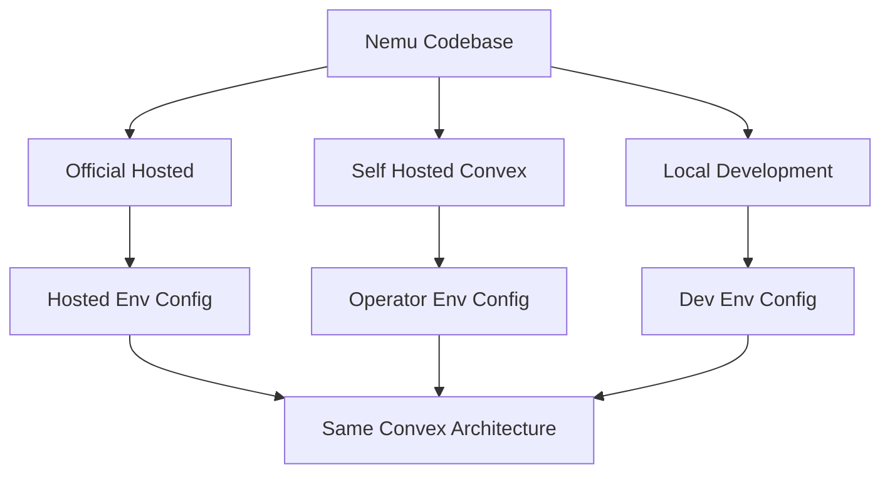

# Self-Hosted Plan

## Purpose

Keep Nemu self-hostable without creating a second backend architecture.

This plan follows `usage-limits.md` and `permissions.md` because self-hosting should reuse the same Convex, Better Auth, sync, and usage-limit architecture. The goal is to make hosted and self-hosted deployments differ by configuration, not by code paths.

## Current Codebase Facts

- Convex is already the backend runtime and database for synced user data.
- `convex/convex.config.ts` wires Better Auth and R2 components.
- `convex/auth.ts` configures Better Auth with `SITE_URL`, `DEV_URL`, OAuth providers, and cross-domain cookies.
- `convex/auth.ts` currently hardcodes `crossSubDomainCookies.domain` as `.nemu.pm`.
- `src/lib/auth-client.ts` reads `VITE_CONVEX_SITE_URL` for Better Auth's base URL.
- Client code uses `VITE_CONVEX_URL` and `VITE_CONVEX_SITE_URL` to reach Convex query/action and HTTP endpoints.
- AI features depend on provider envs such as `AI_GATEWAY_API_KEY`, `GOOGLE_AI_STUDIO_API_KEY`, `ELEVENLABS_API_KEY`, and `ELEVENLABS_VOICE_ID`.
- The proxy service under `services/proxy/` already has separate env-driven rate limiting, but that is not per-user Convex quota.

## Product Rules

- Self-hosted should use Convex, not a separate Postgres/SQLite backend.
- Self-hosted should not require billing, supporter tiers, or quota setup.
- Self-hosted should default usage limits to unlimited.
- Official hosted defaults should remain easy to configure.
- Official-domain assumptions must be configurable.
- Missing provider keys should disable or fail only the relevant hosted AI feature, not the whole app.

## Deployment Modes




### Official Hosted

- Nemu operates the Convex deployment.
- Better Auth account system is enabled.
- OAuth provider credentials are configured by Nemu.
- Hosted AI provider keys are configured by Nemu.
- Usage limits are enabled.
- Supporter rows can exist in `usage_plans`.
- Total daily limits protect global hosted spend.

### Self-Hosted Convex

- The operator runs their own Convex deployment.
- The operator configures their own app URL and Convex URLs.
- Quotas are unlimited by default.
- Supporter tiers are not required.
- Hosted AI features work only when the operator provides the relevant provider keys.
- Admin/billing tooling is optional.

### Local Development

- Same defaults as self-hosted.
- Quotas are unlimited unless explicitly enabled for testing.
- Provider keys may be missing; features should preserve existing fallbacks/errors.

## Required Configuration Surface

### Client

```txt
VITE_CONVEX_URL=
VITE_CONVEX_SITE_URL=
```

`VITE_CONVEX_URL` is used for Convex client operations. `VITE_CONVEX_SITE_URL` is used for Better Auth and Convex HTTP action endpoints.

### Convex Auth

```txt
SITE_URL=
DEV_URL=
COOKIE_DOMAIN=
GOOGLE_CLIENT_ID=
GOOGLE_CLIENT_SECRET=
APPLE_CLIENT_ID=
APPLE_CLIENT_SECRET=
APPLE_APP_BUNDLE_ID=
```

Recommended behavior:

- `SITE_URL` is the public app URL.
- `DEV_URL` is optional for local development.
- `COOKIE_DOMAIN` is optional.
- Official hosted sets `COOKIE_DOMAIN=.nemu.pm`.
- Self-hosted usually leaves `COOKIE_DOMAIN` unset.
- `crossSubDomainCookies` should only be enabled when `COOKIE_DOMAIN` is configured.

### AI Providers

```txt
AI_GATEWAY_API_KEY=
GOOGLE_AI_STUDIO_API_KEY=
ELEVENLABS_API_KEY=
ELEVENLABS_VOICE_ID=
```

Provider config should stay feature-specific:

- Missing `AI_GATEWAY_API_KEY` affects Japanese normalization.
- Missing `GOOGLE_AI_STUDIO_API_KEY` affects metadata and TTS tagging.
- Missing `ELEVENLABS_API_KEY` or `ELEVENLABS_VOICE_ID` affects TTS.

### Usage Limits

```txt
NEMU_USAGE_LIMITS_ENABLED=false
NEMU_USAGE_CHAT_USER_DAILY=40
NEMU_USAGE_CHAT_SUPPORTER_DAILY=250
NEMU_USAGE_CHAT_TOTAL_DAILY=12000
NEMU_USAGE_TTS_USER_DAILY=60
NEMU_USAGE_TTS_SUPPORTER_DAILY=400
NEMU_USAGE_TTS_TOTAL_DAILY=12000
NEMU_USAGE_METADATA_USER_DAILY=150
NEMU_USAGE_METADATA_SUPPORTER_DAILY=600
NEMU_USAGE_METADATA_TOTAL_DAILY=18000
```

Only `NEMU_USAGE_LIMITS_ENABLED=true` should be needed to enable official defaults. Numeric values are overrides for staging and self-hosted operators.

## Phases

### Phase 1: Auth Domain Configuration

Files:

- `convex/auth.ts`
- `src/lib/auth-client.ts` if client assumptions need cleanup

Deliverables:

- Replace hardcoded `.nemu.pm` cookie domain with optional `COOKIE_DOMAIN`.
- Preserve official hosted behavior when `COOKIE_DOMAIN=.nemu.pm`.
- Allow host-scoped cookies when `COOKIE_DOMAIN` is unset.
- Keep `getHttpSession(ctx, request)` compatible with `Better-Auth-Cookie` for custom HTTP actions.

This phase should happen before claiming self-hosted auth is supported.

### Phase 2: Deployment Config Helpers

Files:

- `convex/deployment_config.ts` or a small equivalent helper module
- `convex/usage_policy.ts` from `docs/plans/usage-limits.md`

Deliverables:

- Consistent boolean env parsing.
- Consistent numeric env parsing.
- Hosted defaults centralized.
- Unlimited usage default for self-host/local mode.
- Tests for config parsing.

This phase can be shared with usage-limit implementation.

### Phase 3: Provider Capability Behavior

Files:

- `convex/ai_metadata.ts`
- `convex/japanese_learning.ts`
- `convex/tts.ts`
- Client surfaces that call these features

Deliverables:

- Document which features need which provider keys.
- Preserve existing fallback behavior where present.
- Return understandable errors for missing provider config.
- Avoid making quota errors hide provider configuration errors.

This phase can be incremental and feature-by-feature.

### Phase 4: Self-Hosted Documentation

Deliverables:

- Add setup docs for running the app with a self-hosted Convex deployment.
- Document required client envs.
- Document optional auth provider envs.
- Document optional AI provider envs.
- Document quota default as unlimited.
- Document how to enable quotas for operators who expose shared AI keys.

This should come after the auth-domain cleanup so the docs do not describe a path that fails on non-`nemu.pm` domains.

### Phase 5: Optional Operator Controls

Only add when self-hosted operators need them.

Possible deliverables:

- Debug query for current usage.
- Internal mutation to set `usage_plans` rows.
- Admin env allowlist.
- Feature capability query showing which AI providers are configured.

Do not build a full admin product for self-hosting in the initial pass.

### Phase 6: Future Storage And Object Hosting

Only revisit if self-hosted deployments need alternatives to current object storage behavior.

Possible topics:

- R2 configuration
- Local object storage
- Backup/restore
- Migration between Convex deployments

This is separate from usage limits and permissions.

## Testing Strategy

Coverage to add when implementation starts:

- Auth config leaves cross-subdomain cookies disabled when `COOKIE_DOMAIN` is unset.
- Auth config preserves `.nemu.pm` behavior when `COOKIE_DOMAIN=.nemu.pm`.
- Usage config is unlimited by default.
- Usage config enables hosted defaults when `NEMU_USAGE_LIMITS_ENABLED=true`.
- Numeric overrides are parsed safely.
- Missing provider keys produce feature-specific errors or fallbacks.

Run during implementation:

```bash
bun test
bun run typecheck
bun run lint
```

## Open Questions

- Should self-hosted docs recommend local Convex dev, self-hosted Convex backend, or both?
- Should OAuth be required for self-hosted, or should email/password or another auth mode be supported later?
- Should hosted AI features be explicitly marked unavailable when provider keys are missing?
- Should self-hosted operators get a minimal admin mutation for `usage_plans`, or should quotas remain env-only unless official billing exists?

