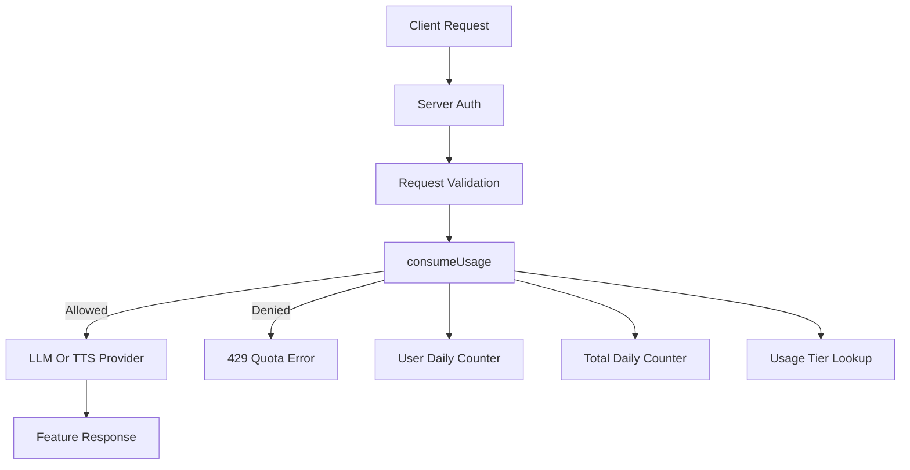

# Usage Limit Plan

## Purpose

Add Convex-side daily usage limits for hosted AI features without introducing a general permissions system.

This plan is first because it solves the immediate cost-control problem. It should produce a small quota layer that future user-system and self-host work can build on, but it should not depend on those future systems.

## Non-Goals

- R2 cover-upload abuse limiting. R2 quotas need a different model (per-device anonymous id, rolling-window limits, content-type/size validation) and are tracked separately from the AI feature buckets here.
- Resource-level permissions (sharing, ownership, role-based access). See `permissions.md`.
- Provider-key management for self-hosted operators. See `self-hosting.md`.

## Current Codebase Facts

- Chat lives in `convex/nemu_chat.ts` as a Convex `httpAction`.
- TTS lives in `convex/tts.ts` as a Convex `httpAction`.
- Chat and TTS already authenticate through `getHttpSession(ctx, request)` from `convex/auth.ts`.
- Metadata AI actions live in `convex/ai_metadata.ts` and currently do not enforce server-side auth.
- Japanese normalization lives in `convex/japanese_learning.ts` and currently does not enforce server-side auth.
- Japanese normalization currently calls Convex through an unauthenticated `ConvexHttpClient` in `src/lib/plugins/builtin/japanese-learning/store.ts`.
- User-scoped Convex data uses `identity.subject` through `requireAuth` in `convex/_lib.ts`.
- There is currently no plan, supporter, billing, permission, or usage table in `convex/schema.ts`.
- Bun tests are rooted at `src/` via `bunfig.toml`, so pure policy tests should live under `src/` unless test discovery is intentionally changed.

## Product Rules

- `user` and `supporter` are quota tiers, not permissions.
- Quota checks happen server-side before expensive model/provider calls.
- Self-hosted and local development default to unlimited usage unless limits are explicitly enabled.
- Metadata and Japanese normalization share the `metadata` bucket at first, even though they may dispatch to different providers (Google AI Studio for metadata tagging, AI Gateway for Japanese normalization). The bucket is a usage-cost abstraction, not a provider abstraction. Split later if observed costs justify it.
- Total daily limits protect the hosted deployment as a whole.
- Counter increments are atomic: the user counter increments first, then the total counter; if the total counter denies, the user counter rolls back. This avoids drift where a user appears to have consumed quota that the total cap actually rejected.
- Quota-denied responses are surfaced as a `ConvexError` carrying a stable string code (e.g. `USAGE_LIMIT_EXCEEDED`) plus structured metadata (feature, tier, used, limit, resetAt). Clients match on the code, not the message, and can render an i18n toast.
- An admin bypass list is supported via `NEMU_USAGE_ADMIN_USER_IDS` (comma-separated `identity.subject` values). Listed users skip both the user and total counters. The list is empty by default.

## Initial Limits

- `chat`: `40` user / `250` supporter / `12k` total requests per day
- `tts`: `60` user / `400` supporter / `12k` total requests per day
- `metadata`: `150` user / `600` supporter / `18k` total requests per day

## Target Flow




## Proposed Schema

Add focused usage tables to `convex/schema.ts`.

### `usage_daily`

One row per UTC day, feature, and scope.

```ts
{
  day: string; // "YYYY-MM-DD" in UTC
  feature: "chat" | "tts" | "metadata";
  scope: "user" | "total";
  scopeId: string; // user id for user scope, "total" for global scope
  used: number;
  updatedAt: number;
}
```

Suggested indexes:

- `by_day_feature_scope`: `["day", "feature", "scope", "scopeId"]`
- `by_scope`: `["scope", "scopeId"]`

### `usage_plans`

Small quota-tier override table.

```ts
{
  userId: string;
  tier: "user" | "supporter";
  updatedAt: number;
}
```

Suggested index:

- `by_user`: `["userId"]`

This table should not become a permissions table. It only answers: "which quota tier does this user belong to?"

## Proposed Code Units

### `convex/usage_policy.ts`

Pure quota policy and config parsing.

Responsibilities:

- Define feature and tier types.
- Store hosted default limits.
- Parse usage-limit env configuration.
- Return unlimited when `NEMU_USAGE_LIMITS_ENABLED !== "true"`.
- Respect numeric env overrides when limits are enabled.
- Map `japanese_normalization` to the `metadata` bucket.
- Evaluate whether current usage can consume one more request.

### `convex/usage.ts`

Convex-facing usage API.

Responsibilities:

- Internal mutation to consume one unit.
- Query current user usage for future UI/debug display.
- Read `usage_plans`.
- Update both user and total counters before expensive provider calls.
- Throw structured quota errors when denied.

### `convex/_lib.ts`

Extend auth helpers so actions can require auth consistently.

`requireAuth` currently accepts query/mutation contexts. Metadata and normalization are actions, so add an action-compatible helper or widen the existing type carefully.

The canonical user id should remain `identity.subject`.

## Phases

### Phase 1: Pure Policy

Deliverables:

- `convex/usage_policy.ts`
- Types for quota features, buckets, tiers, and limit results
- Hosted defaults for `chat`, `tts`, and `metadata`
- Env parsing with unlimited default
- Numeric override support
- Pure unit tests under `src/`

This phase should not change runtime behavior.

### Phase 2: Schema

Deliverables:

- `usage_daily` table
- `usage_plans` table
- Required indexes
- `convex deploy` (or `npx convex dev` push for local) so the new tables actually exist before any consumer phase lands.

Keep this schema narrow. Do not add resource permissions or billing tables here.

### Phase 3: Consume API

Deliverables:

- `convex/usage.ts`
- Internal mutation that checks user and total counters
- Concrete quota-denied error shape exported as a type so clients can match it without string-comparing messages:

  ```ts
  export const USAGE_LIMIT_EXCEEDED = "USAGE_LIMIT_EXCEEDED" as const;
  export interface UsageLimitDeniedData {
    code: typeof USAGE_LIMIT_EXCEEDED;
    feature: "chat" | "tts" | "metadata";
    scope: "user" | "total";
    used: number;
    limit: number;
    resetAt: number; // epoch ms of next UTC reset
  }
  // Throw via: throw new ConvexError<UsageLimitDeniedData>({...})
  ```

- UTC day key helper
- Tier lookup helper

This phase creates the server API but does not yet gate features.

### Phase 4: Chat And TTS Enforcement

Files:

- `convex/nemu_chat.ts`
- `convex/tts.ts`
- `src/lib/plugins/builtin/japanese-learning/chat/service.ts`
- `src/stores/tts.ts`

Rules:

- Authenticate first.
- Validate request shape/body.
- Consume quota before Anthropic, Gemini, or ElevenLabs calls.
- Return or surface `429` for quota errors.
- Preserve existing `401`, `405`, `413`, CORS, and stream behavior.

### Phase 5: Metadata And Normalization Enforcement

Files:

- `convex/ai_metadata.ts`
- `convex/japanese_learning.ts`
- `src/lib/plugins/builtin/japanese-learning/store.ts`
- `src/components/metadata-match-drawer.tsx`
- `src/components/source-add-drawer.tsx`

Rules:

- Require server-side auth before model calls.
- Count metadata actions against the `metadata` bucket.
- Count Japanese normalization against the `metadata` bucket.
- Replace unauthenticated normalization calls with the authenticated app Convex client.
- If auth is loading or missing, prompt sign-in and fall back to original text for normalization.

### Phase 6: Optional Usage Display

Only add UI if it becomes useful.

Possible surfaces:

- Settings page daily usage summary
- Supporter upsell copy
- Debug-only usage query

Do not build this in the first pass unless there is a concrete product need.

## Tier Assignment Surface

The `usage_plans` table answers "which tier does this user belong to?" but does not say how rows get there. Three options, ordered by complexity:

1. **Manual rows.** Operator inserts a row in Convex Dashboard or via a small admin mutation. Suitable for a small supporter list, no recurring billing integration needed.
2. **Env allowlist.** `NEMU_USAGE_SUPPORTER_USER_IDS` env var gives a comma-separated list of `identity.subject` values resolved to `supporter` at policy-evaluation time. Useful for ops/contributor accounts. Combine with `usage_plans` rows for paying users.
3. **Webhook from billing provider.** Patreon, Buy-Me-A-Coffee, or Stripe webhook hits a Convex `httpAction` that upserts `usage_plans` with the resolved tier. Future work — only build when a billing channel is actually live.

Manual rows + env allowlist cover the first deployment; webhooks come later if/when paid tiers ship.

## Testing

Suggested pure test file:

```txt
src/lib/usage-policy.test.ts
```

Coverage:

- Quotas are unlimited by default.
- `NEMU_USAGE_LIMITS_ENABLED=true` enables hosted limits.
- Numeric env overrides replace hosted defaults.
- User and supporter limits resolve correctly.
- Total limits deny even if user limit has remaining capacity.
- Boundary cases: zero usage, exactly at limit, one over limit.
- UTC day reset computes the next reset boundary.
- Japanese normalization resolves to the metadata bucket.

Run during implementation:

```bash
bun test
bun run typecheck
bun run lint
```

## Rollout

1. Land policy with enforcement disabled by default.
2. Land schema.
3. Deploy to development Convex and verify no behavior changes.
4. Enable `NEMU_USAGE_LIMITS_ENABLED=true` in a non-production deployment.
5. Test quota denials with very low temporary limits.
6. Wire Chat and TTS.
7. Wire metadata and normalization.
8. Enable hosted production limits.
9. Add supporter rows to `usage_plans` manually at first.

## Open Questions

- Should total daily limits hard-deny or degrade gracefully with a maintenance-style message?
- Should `metadata` and `japanese_normalization` split after observing real cost?

