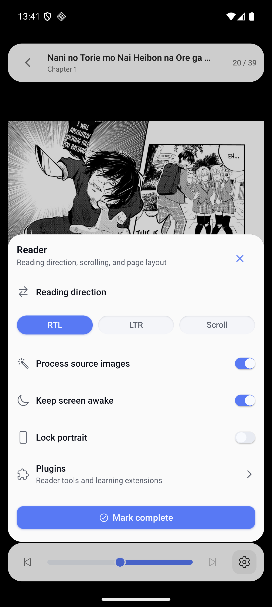
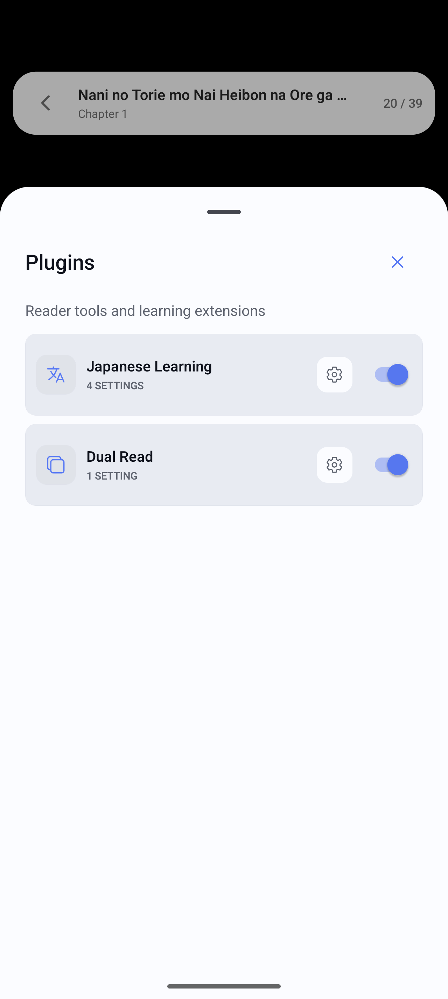
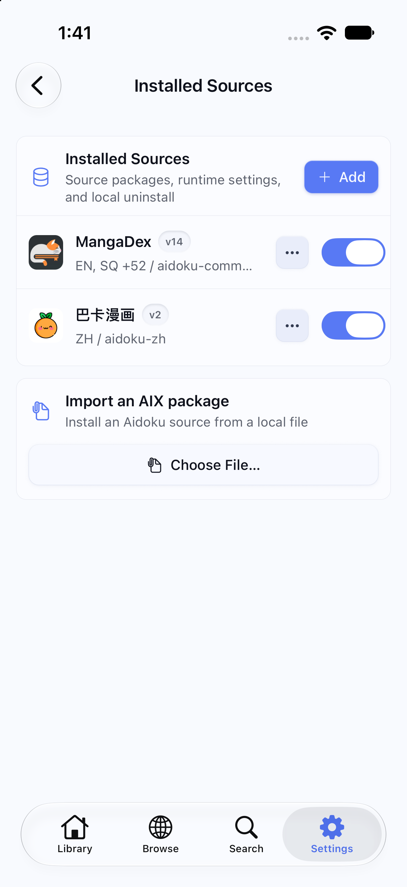
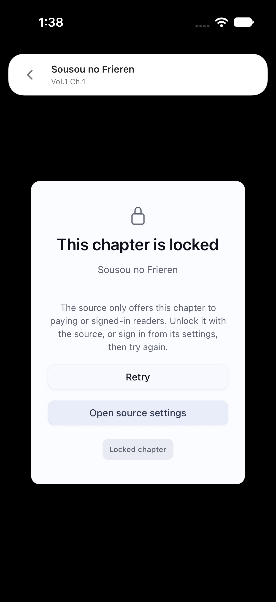
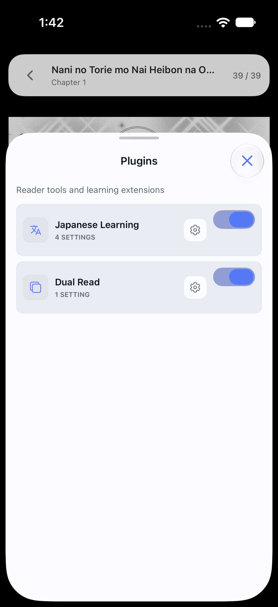

# PR #33 mobile audit and verification

Verified on 2026-09-26. This completes the Android follow-ups, iOS feature audit,
and mobile account-sync investigation started in the Claude Code session.

## Changes

- Android sheet sizing, spacing and keyboard clearance; native language names
  without JavaScript `Intl`; readable direction chips; reader plugin settings.
- Android Cloudflare probe and source/host-scoped clearance User-Agent binding.
- Immediate mobile cloud writes through the profile-guarded store; automatic
  installation of account sources; disabled sources skip package downloads;
  unchanged progress snapshots no longer emit change events.
- Recoverable missing-source installation on mobile and web library detail.
- Detail refresh survives same-key data updates without leaving a spinner.
- Device-wide welcome completion survives sign-in and sign-out.
- Fixed-width source-grid cells, empty-library collection management, removal
  navigation, localized source failures, large-text detail layout, and correctly
  sized iOS switches with one actionable accessibility element.
- Shared web/mobile first-chapter selection, accessible/touchable reader scrubber,
  measured page-aware chapter-edge gestures, previous-chapter entry from page 1,
  bounded page-image prefetch, Dual Read auto-selection and scanlator subtitles.
- Locked-chapter recovery copy, including preservation of the lock flag through
  reader navigation; next-chapter image prefetch scoped by full request identity.
- iOS HTTP proxy replenishes its incoming-connection budget after accepts and
  closes. Previously all source requests stalled after 64 total connections.

## Final local checks

| Check | Result |
| --- | --- |
| `bun run test:coverage` | 362 web + 89 integration + 264 core tests passed |
| Mobile Bun tests with coverage | 2,592 passed; 90.62% line coverage |
| Mobile sandbox bundle and Swift policy executables | 2 passed |
| `bun run typecheck` | Passed (core, web and Convex) |
| `bun run mobile:typecheck` | Passed |
| Root / mobile lint | 0 errors; existing warnings remain |
| `bun run build` | Passed |
| iOS simulator Release build (`xcodebuild`) | Passed |
| Android arm64 Release APK (`:app:assembleRelease`) | Passed |
| Android `:nemu-aidoku:testDebugUnitTest` | 114 passed, 0 failures/errors |
| Real Swift loopback-proxy regression | 128 sequential connections answered; no source network access |
| `git diff --check` | Passed |

The Swift connection regression is part of the local native test runner and the
GitHub iOS workflow. It tests the actual proxy listener, not just budget arithmetic.

## Simulator verification

Final Release packages were installed on the iOS 27 iPhone 17 Pro QA simulator
and the Android API 36 arm64 emulator.

- iOS library detail loaded 143 live MangaDex chapters without the former spinner.
  Start reading selected volume 1, chapter 1; the locked chapter displayed its
  dedicated recovery copy instead of the generic missing-data error.
- iOS reader scrubber tapped from page 39 to 20, dragged to 30, and exposed a
  named adjustable accessibility element. RTL mid-chapter movement advanced one
  page. At chapter 1's last page, advancing opened chapter 2 page 1; retreating
  returned to chapter 1 page 39.
- Android scrubber moved from page 1 to 20. RTL/LTR/Scroll labels fit. Reader
  settings opened the Plugins sheet. Android crash log remained empty.
- iOS reader settings dismissed before presenting Plugins; Done dismissed it.
- iOS switches fit inside Installed Sources cards, exposed one named switch each,
  and responded to ordinary touch (off/on, original enabled state restored).
- Live maximum accessibility text-size changes reflowed the detail hero and
  primary action without restarting. Font size was restored afterward.

Earlier session verification covered onboarding in English/Chinese/Japanese,
light/dark themes, source installation and settings, browse/search/filtering,
metadata editing, collections, reading modes, progress/resume, and Android sheet
presentation. Those results are retained rather than represented as newly rerun.

## Account sync evidence retained from the earlier session

A development test account was used to verify both directions between web and
mobile: library entries, collection membership, chapter progress, installed-source
arrival and automatic package installation, source uninstall, item/collection
removal, sign-out with local data removal, and re-sign-in. A mobile source install
reached cloud and web within seconds after the store-identity fix. Temporary test
sessions were deleted. No production account or backend deployment was changed.

The final automated suite rechecks guarded-store foreground writes, isolation from
another account, unchanged snapshot delivery, and disabled-package hydration.
Anonymous-to-account merging and offline retry were not newly exercised live.

## Remaining external or device-only limits

- `https://ocr.nemu.pm/health` still returned HTTP 521 on recheck. Successful OCR
  and OCR-dependent learning/chat could not be verified; the error/retry UI works.
- Fast Android sheet flicks remain sensitive to emulator input timing. Prior
  instrumented tests found working nested-scroll handoff but intermittent low
  release velocity. A physical Android device is still needed for that assessment.
- Earlier sync testing identified mismatched local development auth/data URLs,
  dev localhost CORS configuration, and an exposed development Apple key requiring
  rotation. No credentials or environment values are included here.
- Native mobile Tachiyomi execution remains unsupported by design.

No new environment variables or Convex deployment are required for these fixes.

## Screenshots

| Android reader settings | Android plugin sheet |
| --- | --- |
|  |  |

| iOS source switches | iOS locked chapter |
| --- | --- |
|  |  |

